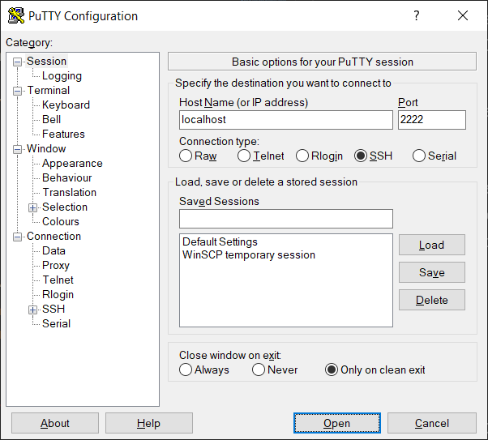
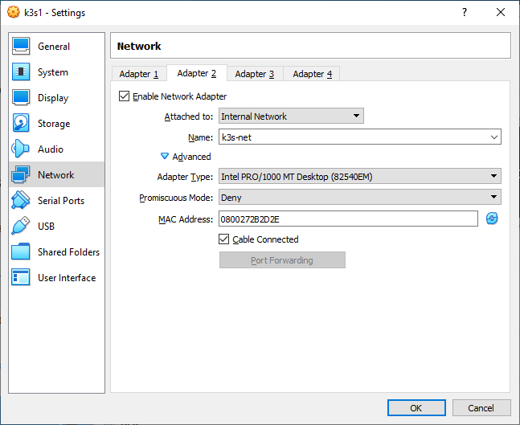

# Introduction to containers

A multi-part session that aims to cover various basic concepts and techniques when working with containers. The journey starts with a single **Docker** host. Then, once the basics are covered, will move on to a single **k3s** host. It will be used to do a transition to the **Kubernetes** way of working with containers. Finally, if the time allows, a three-node **k3s** cluster will be created.

All sections marked with (*) are not mandatory.

## Introduction to containers with Docker

Two parts here:
 - slides - why containers; containers vs virtual machines; types of containers; Docker; workflow; Dockerfile
 - demo - install Docker; basic post-config; run a few containers; create image; run a multi-container application
 
### Create virtual machine from template (VirtualBox)

First, we must create the virtual machine using one of the provided templates:
1) Start **VirtualBox**
2) Go to **File** > **Import Appliance**
3) Click the **Browse** button and navigate to the downloaded template
4) Select it and confirm with **Open**
5) Click **Next**
6) Change the name to **opensuse-docker**
7) Adjust the rest of the parameters as you like
8) Click **Import** to start the process

After a few moments our new virtual machine will appear in the list. 

### Prepare network connectivity (VirtualBox)

By default, our new virtual machine, is connected in NAT mode. This is fine for this first part, and yet we have to make a few adjustments.

Should we want to communicate with the virtual machine from our host, which is exactly what we want, we must set a few port-forwarding rules.

Let's create two - one for the SSH communication and one for accessing WEB services on the virtual machine. Execute the following actions:

1) With **VirtualBox** started, select the virtual machine
2) Navigate to **Machine** > **Settings**
3) Switch from **General** to **Network** view
4) While in **Adapter 1** settings, click the **Advanced** option
5) Then click the **Port Forwarding** button
6) To add a rule, click on the little green button in the top right corner of the window
7) Change rule's attributes to 
   - Name -> ***SSH***
   - Protocol -> ***TCP***
   - Host Port -> ***2222***
   - Guest Port -> ***22***
8) Add one more rule and change its attributes to 
   - Name -> ***WEB***
   - Protocol -> ***TCP***
   - Host Port -> ***8080***
   - Guest Port -> ***8080***
9) Click **OK** to close the **Port Forwarding Rules** window and then once again **OK** to close virtual machine' settings window

### Start the virtual machine and establish a connection

We are ready to begin our journey. With **VirtualBox** started, select the virtual machine and go to **Machine** > **Start** > **Normal Start**.

Now, after the machine is ready, we can work on its **console** (the window that appeared) or open a **SSH session** to it. The first option doesn't require any additional software but has its limitations. The main one being that we cannot use copy-paste between the host and the virtual machine. So, we will go with the second approach. But first, we must make sure that we have a **SSH client** installed. With modern versions of **Windows 10** we have **OpenSSH** installed by default. This applies to **macOS** and all **Linux** distributions as well. If we have an older version of **Windows** or we just want to try something else, we can install the **PuTTY** client (https://www.putty.org/) which happens to be one of the most popular options.

#### Command line SSH client

Open a terminal session on your host machine. On Windows this could be either PowerShell or Command Prompt window. On macOS and various Linux distributions it may come under different name like **Terminal**, **Konsole**, etc.

Once, on the terminal, enter:

```
ssh -p 2222 user@localhost
```

On your first session to this machine, you may be asked to confirm the connection. Do it by entering ***yes***. Then enter ***linux*** as password (keep in mind that no characters will be displayed while you type) and hit **Enter**. 

Now, you should see a prompt like this one:

```
user@opensuse:~>
```

#### PuTTY

If you go with the **PuTTY** or another similar client, then your way of entering the connection details will be like the shown on this picture:



Once you enter the credentials and establish a connection, everything else will behave the same no matter which client you use.

### Install Docker

Installing **Docker** on **openSUSE Leap** is a simple task. It is enough to execute the following command:

```
sudo zypper install docker
```

Enter the password for the **root** user (which in our case is also set to **linux**) and press **Enter**. A few other packages will be installed as well. Confirm by typing ***y*** and hit **Enter**.

That is almost all, we have it installed. However, there are a few other task which we have to deal with.

Set the **Docker** service to start automatically on boot:

```
sudo systemctl enable docker
```

And then start it:

```
sudo systemctl start docker
```

We can check if the service started:

```
systemctl status docker
```

And if it showed **active (running)**, we may test that we can interact with it by asking for its version:

```
sudo docker version
```

We should see both the version of the client utility and the service (or daemon).

Next, we must add our user to the **docker** group. For this, we will execute:

```
sudo usermod -aG docker user
```

Now, in order some of the changes to take effect, we must close our session by executing the following command:

```
exit
```

Open a new session and once in, try to execute the following command (this time without **sudo** in front of it):

```
docker version
```

In addition, we may ask for even more details with:

```
docker info
```

Both should work. Now, we are all set up and can start our journey with **Docker**.

### Start our first container

Let's check if we have any container images already:

```
docker image ls
```

Now, we do not have any. This is a brand new installation, after all. 

Start one to see that everything works as promised:

```
docker container run hello-world
```

It works! From the output, we can see that it did not find the image locally, then downloaded it, and finally, started the container. While this is not something extraordinary, it proves that our setup works as expected.

Now, let's list the container images again:

```
docker image ls
```

Aha, now we have one. It was used to start our first container. Can we use it to start another one? Yes, we can. So, let's do it:

```
docker container run hello-world
```

This time the execution took less time. The main reason behind this is that we have the image locally and there is no need to spend time downloading it again.

Let's check what containers we have. We started two so far, so we expect to see them. Execute this:

```
docker container ls
```

Hm, none. Strange. In fact, it is by design. We started two containers but both executed, showed something, and then exited. So, we do not have any running containers (which is what this command shows). And is there any way to see those that exited? Yes, execute the following modified version of the command:

```
docker container ls -a
```

Here, we can see them. We can see some details about them like ID, image, name, etc.

Let's delete them. First, we will use an ID:

```
docker container rm <container-id>
```

And then we will use a name:

```
docker container rm <container-name>
```

Now, if we ask again for the list of all containers (running and stopped):

```
docker container ls -a
```

We won't see anything. And our container image? Is it still there? Let's check

```
docker image ls
```

Yes, it is there. Can we delete it? Of course. Execute:

```
docker image rm hello-world
```

And if we check again:

```
docker image ls
```

We won't see anything. All are gone. With images, just like with containers, we can use the ID as well. Remember, that we can delete only images, that are not referred by any container - either running or stopped.

### Start a container in interactive mode

Now, let's start a container and interact with it:

```
docker container run -it ubuntu bash
``` 

After a while we will be presented with a different prompt. We are inside the container. Let's execute a few commands:

```
ps ax

uname -a

cat /etc/os-release

ls -l /

echo 'Hello Container! :)' > /hello.txt

cat /hello.txt
```

In this particular case, all worked as expected. It is not always like this. It depends on what the author of the image decided to include.

Okay, but how can we return to our initial session? There two ways - to terminate the **bash** session in the container by executing **exit** or just close the session without terminating it by pressing **Ctrl+P** and then **Ctrl+Q**. 

Let's try the first way. Execute:

```
exit
```

And check if our container is still running:

```
docker container ls -a
```

No, it exited. We caused this by terminating the only process that was running inside the container. This is by design.

Now, start a new one:

```
docker container run -it ubuntu bash
```

Once, inside the container, press **Ctrl+P** and then **Ctrl+Q** to close just the session. Now, check the state of the containers with:

```
docker container ls -a
```

This time, we have one running and one stopped. We can stop the running one from here, just execute:

```
docker container stop <container-name-or-id>
```

Please note, that when we use the ID, instead of typing all its symbols, we can use just the first few that identify it amongst the others.

### Start a container in detached mode

Starting a container in interactive mode while not that rare, is not the typical way of using containers. We usually work in interactive mode, when we want to troubleshoot strange behavior or try something.

The most common way of running containers is in background or detached mode. For example, we can run a web server in a container or some other process that does its work in the background.

Let's start one container that doesn't do anything but to sleep for 1 day. We can do it with this command:

```
docker container run -d --name sleeper alpine sleep 1d
```

It is based on Alpine Linux and just sleeps for 1 day (if we allow it). One more thing, this time, we named the container. This will make our interaction with it easier.

Let's see the list of running containers:

```
docker container ls
```

It is there. Okay but what if we want to do something inside such a container? We can start a process inside it and attach to it. Usually this process is a shell. Which one, depends on the container. In this particular case, we can execute this:

```
docker container exec -it sleeper sh
```

Once in, execute the following commands:

```
ps ax

cat /etc/os-release
```

There is not just the process with ID 1 (which in our case is the sleep command) but also the **sh** process. Now, close the session by executing this:

```
exit
```

And check the list of running containers:

```
docker container ls
```

Aha, it is not gone. The reason for this is that we terminated the **sh** process but it wasn't the only one there. The **sleep** process "keeps" the container in running state.

We can stop this one now by executing:

```
docker container stop sleeper
```

### Start a container and publish a port

Now, let's run a web server based container and see how we can access the web page that is inside it. Start the container with the following command:

```
docker container run -d --name web -p 8080:80 nginx
```

This will start a named container in detached mode. We went over this, so we know it. The new part here (**-p 8080:80**) does the real magic. It will **publish** (**forward**) port **80** of the container to port **8080** on the virtual machine where **Docker** is running. There is a long version of the option as well - **--publish**.

But our machine does not have desktop environment. How can we access this page? We can use a command. Execute the following:

```
curl http://localhost:8080
```

Yes. We can "see" the default web page of the **NGINX** web server that is running inside the container. 

Can we see it better? Yes, we can. Remember that in the beginning, while we were setting our virtual machine, we created two port forwarding rules? Now, we will utilize the second one. Open a browser on your host machine and navigate to http://localhost:8080. Now, this is another story. 

So, in summary, we have this chain of port forwarding:

```
Container (80) -> Virtual Machine (8080) -> Physical Machine (8080)
```

Now, stop and remove the container with:

```
docker container rm --force web
```

The **--force** flag is required as the container is still running.

### Exchange data with container

Can we change the default web page? Yes, we can. Let's first prepare something. 

Create a folder in the home folder of the current user:

```
mkdir ~/web
```

Then create a simple **index.html** file inside the folder with the following command:

```
echo 'Hello Container World! :)' > ~/web/index.html
```

Now we have all that we need. Let's start another container, but this time using an extended command:

```
docker container run -d --name web -v ~/web:/usr/share/nginx/html -p 8080:80 nginx
```

The new bit there is the **-v** flag (its long version is **--volume**) with which we attached our local folder **~/web** as the **/usr/share/nginx/html** folder in the container. This mage all our local files in the source folder available in the container. Further details on how to work with this image can be found here: https://hub.docker.com/_/nginx

We can test it both on the command line in the virtual machine and in a browser tab on the host. It will work either way.

Once done exploring, stop and remove the container with:

```
docker container rm --force web
```

### Create and publish own container image

Let's go even further and create our own simple container image. It will be based on this image **php:apache** (https://hub.docker.com/_/php). 

Create a new folder, in the home folder of our user on the virtual machine, to accommodate all necessary files and change to it:

```
mkdir ~/docker-image

cd ~/docker-image
```

Now, create one more folder:

```
mkdir web
```

And then create a simple **index.php** file with the following content:

```php
<?php
  print "<h2>Hello Container World!</h2>\n";
  print "<hr />\n";
  print "<small><i>Running on <b>".gethostname()."</b></i></small>\n"; 
?>
```

You can use for example the **nano** text editor. Start it with:

```
nano web/index.php
```

And paste the above text there. Then press **Ctrl+O** to save the file and confirm with **Enter**. Once done, press **Ctrl+X** to close the file.

Before we continue, we should test our **PHP** code. Let's start a container and inject it there:

```
docker container run -d --name web -v ~/docker-image/web:/var/www/html  -p 8080:80 php:apache
```

Test the result either on the command line or in a browser. It should work and besides the greeting, should show the name of the container in which it is working. 

Stop and remove the container:

```
docker container rm --force web
```

Now that we are sure in our code, we must create one more file. This is the **Dockerfile** file which will contain the instructions for the creation of our container image.

Start the **nano** editor and create a new **Dockerfile**:

```
nano Dockerfile
```

Now, type in or paste the following text:

```Dockerfile
# The base image for our image
FROM php:apache

# Set metadata about who is the author of the image
LABEL author='Student Name <student@university.edu>'

# Copy the project files
COPY web/ /var/www/html/
```

Press **Ctrl+O** to save the file and confirm with **Enter**. Once done, press **Ctrl+X** to close the file. 

This is how our **docker-image** folder should look like:

```
docker-image/
├── Dockerfile
└── web
    └── index.php
```

Next, we must build our image. For this, we should execute the following:

```
docker image build -t myimage .
```

Please note that the above command should be executed in the folder where we have the **Dockerfile**.

Now, let's see if our image appears in the list of images:

```
docker image ls
```

Yes, here it is. Let's start a container out of it:

```
docker container run -d --name web -p 8080:80 myimage
```

Now, check the list of the running containers:

```
docker container ls
```

And use the **curl** command to access the web page in the container:

```
curl http://localhost:8080
```

It works. The feeling is good. :)

Stop and remove it:

```
docker container rm --force web
```

There is one more step. Which is not mandatory but we will execute it. We may want to publish our image to a registry. This will allow us to use it on other **Docker** hosts and/or other people may use it as well (if we publish it to a public repository).

We will use the **Docker Hub** registry. Go there (https://hub.docker.com/) and create an account for you. It is a simple process with just a few steps.

Once done, return in the terminal session of our virtual machine and execute the following command to authenticate (or log in) to your account in **Docker Hub**:

```
docker login
```

Enter the name and the password you used during the registration.

Now, we must **tag** our image against our account in **Docker Hub**. Execute the following command:

```
docker image tag myimage <account>/myimage
```

Where ***<account>*** is your username in **Docker Hub**. For example, as mine is ***shekeriev***, the above command will become:

```
docker image tag myimage shekeriev/myimage
```

Now, if we ask for the list of local images:

```
docker image ls
```

We will see two images with the same ID. This is by design. As the two names both point to the same image.

The final step is to publish (or **push**) the image to the registry. Execute the following:

```
docker image push <account>/myimage
```

If you open the web page of Docker Hub and go to your account, you will see the image there. Congratulations! :)

Should we want, we can use it to run a container just like with every other image. We can execute:

```
docker container run -d --name web -p 8080:80 <account>/myimage
```

It should work. Once done, do not forget to stop it and remove it.

### Run a multi container application (*)

Perhaps, you are curious how we can run a multi-container application. Let's see one possible way of doing this.

This is a two-container application. It shows the top 10 cities by population in Bulgaria. One of the containers is a web application and the other is a database.

First, we should create an isolated network to allow the containers to speak to each other:

```
docker network create bgapp
```

Then, we can start the database container with:

```
docker container run -d --name db --net bgapp -e MYSQL_ROOT_PASSWORD=12345 shekeriev/bgapp-db:latest
```

And then, we can start the web container with:

```
docker container run -d --name web --net bgapp -p 8080:80 shekeriev/bgapp-web:embedded
```

Check the list of running containers with:

```
docker container ls
```

Open a browser tab on the host and navigate to http://localhost:8080

It works. Now, besides **Docker**, you know the top 10 cities in Bulgaria by population. :)

Here we saw two additional topics/techniques:
- networks - check here: https://docs.docker.com/network/
- environment variables - check here: https://docs.docker.com/engine/reference/commandline/run/ 

### Clean up

Do not forget to stop and remove the containers of the application together with the network by executing these commands:

```
docker container rm --force web db

docker network rm bgapp
```

We can go even further and delete all images that we do not need any more and all stopped containers. I will leave this to you to experiment with. ;)

## Getting to know Kubernetes with k3s

Two parts here:
 - slides - why orchestration; what is Kubernetes; Kubernetes components; Kubernetes distributions; SUSE Rancher products; k3s; basic objects/resources
 - demo - spin a single k3s instance; introduction to some of the basic resources - namespaces, pods, services; labels and selectors

### Create a single-node Kubernetes cluster based on k3s

For this part we will use a clean machine. If the one from the previous part is still running, stop it. It is up to you to delete it as well.

Import a new machine, using the familiar procedure. Name it **k3s** for example. Forward the same set of ports but adjust the second rule to ***8080 (host) <- 30001 (guest)***. Then start it and open a SSH session to it. Once done, continue with the next paragraph.

Let's turn our new clean virtual machine to a k3s host. It is as simple, as executing just one command. Execute the following:

```
curl -sfL https://get.k3s.io | sudo sh - 
```

It will take care of everything. In less than 30 seconds we will have a fully working k3s server.

There is one minor adjustment that need to do in order to be able to use it easy as a regular user. We must adjust the the permissions of the main configuration file to allow everyone to read it. Execute:

```
chmod go+r /etc/rancher/k3s/k3s.yaml
```

Now, we can execute the following to check the installed version:

```
kubectl version
```

This is the main utility that we will use to control our k3s installation. Usually, this is a separate binary, but in this case it is embedded into the k3s binary. Not that this will change anything for us. It is just an interesting fact.

We can see the list of nodes (only one) of our k3s cluster with:

```
kubectl get nodes
```
 
Should we want more details about the nodes, we can execute this:

```
kubectl get nodes -o wide
```

Or ask for general cluster information with:

```
kubectl cluster-info
```

The list of all available commands can be seen by executing this:

```
kubectl
```

We have plenty of commands. Let's start using (some of) them.

One last step. Clone the repository to get a local copy of the exercise files:

```
git clone https://github.com/shekeriev/suse-tu
```

And enter the folder with the files:

```
cd suse-tu/lecture-3/demo-files
```

Now, we are ready to continue our exploration.

### Explore and get help 

To retrieve a list of all pods (in the default namespace), we can execute:

```
kubectl get pods
```

It appears that there aren't many (in fact, none). We can modify this command to get the pods in all namespaces: 

```
kubectl get pods --all-namespaces
```

Now, we see a few. We can go even further and try to retrieve a list of all resources in all namespaces:

```
kubectl get all --all-namespaces
```

We can use a shorter variant of the **--all-namespaces** option by substituting it with **-A**.

How can we know what resources are supported? We can ask for this by executing: 

```
kubectl api-resources
```

Then perhaps, we want to know th supported API versions. The answer is a matter of executing this: 

```
kubectl api-versions
```

Let's take for example the **pod**. How can we know what instructions or fields should we pass in order to use one? We can ask for information about the POD resource with:

```
kubectl explain pod
```

The field that we are most interested in is the **spec** field. So, let's get information about it:

```
kubectl explain pod.spec
```

Wow, quite a long list. Perhaps, we should ask for the required fields only. So, let's filter for those fields with:

```
kubectl explain pod.spec | grep required
```

It appears that only one field (**containers**) is required. So, let's ask for more information about it:

```
kubectl explain pod.spec.containers
```

Again, quite a long list. Should we need, we know how to filter it.

### Work with pods

We have two ways to work with resources in **Kubernetes** - **imperative** and **declarative**. With the first, we are saying exactly what should be done. And with the second, we are saying what we want to be the state of the cluster or a resource and letting **Kubernetes** figure out how to do it.

Let's try the imperative creation of a pod. Execute the following command to create an NGINX based pod:

```
kubectl run nginx-pod --image nginx
```

Then, check the result:

```
kubectl get pods
```

Okay. Now, we can remove the pod with:

```
kubectl delete pod nginx-pod
```

There is something in between and it is imperative creation with configuration (or manifest) file. Let's first check the contents of the file:

```
cat 1-appa-pod.yml
```

Now, we can create the pod in an imperative fashion but using a file:

```
kubectl create -f 1-appa-pod.yml
```

And of course, check the result:

```
kubectl get pods
```

Wait a while, until its status change to **Running**. Rerun the command a few times.

Sometimes we want to see detailed information about the pod. If this is the case, we can execute: 

```
kubectl describe pod appa-pod
```

Okay, what if we decided that we want to change something? Can we just send an updated configuration of the resource to the cluster? Sure, we can.

First, compare the initial configuration file with its extended version:

```
vimdiff 1-appa-pod.yml 2-appa-pod-ext.yml
```

There is just one difference. We are adding a pair of labels to the pod.

Close the comparison utility by pressing the **Esc** key, then enter **:qa** and hit **Enter**.

Now, apply the changes coming from the extended file with:

```
kubectl apply -f 2-appa-pod-ext.yml
```

Note the warning. It is because of the imperative creation of the initial version of the resource.

Now, let's display detailed information about the pod again: 

```
kubectl describe pod appa-pod
```

Explore the labels section. And as we can see, it changed. 

### Work with services

Our pod hosts a web server but we cannot access it. Is there a solution to this? Yes, there is. We can expose the service running on the pod and make it reachable on the IP address of our single-node cluster. Execute this:

```
kubectl expose pod appa-pod --name=appa-svc --target-port=80 --type=NodePort
```

Let's display information about the service:

```
kubectl get svc appa-svc
```

We can ask for detailed information about the service:

```
kubectl describe svc appa-svc
```

Copy the appa-svc NodePort value and execute the following command:

```
curl http://localhost:<node-port>
```

Okay. Our application is working. 

So this port was auto-generated. This makes it difficult to know in advance and create a port forwarding rule, which is the only way to access the application on the host in our case. Of course, there are solutions to this. One of them is to add/change a port forwarding rule, once we know the actual port. Other solution is to prepare a special manifest for the service. This will allow us to control the value of the NodePort.

Let's remove the service first:

```
kubectl delete svc appa-svc
```

Let's explore the configuration file that we will use to create a similar service:

```
cat 3-appa-svc.yml
```

Now, create the service in a declarative manner: 

```
kubectl apply -f 3-appa-svc.yml
```

Go on and display detailed information about the service:

```
kubectl describe svc appa-svc
```

Note the Endpoints position. It contains a reference to the pod. Now, the NodePort has a fixed and known value. So, we can use it to access the application on the host (we should have the forwarding rule set). Open a browser tab on the host and navigate to http://localhost:8080

And here it is. Our application. It works.

Let's challenge the system and remove the pod:

```
kubectl delete pod appa-pod
```

Now, refresh the open browser tab. The "application" should not be reachable anymore.

Show detailed information about the service:

```
kubectl describe svc appa-svc
```

Note the **Endpoints** position. It is empty now. No pods are served by the service. We deleted the only one that matched the label selectors.

## Work with deployments

As with the pods and services, we can use imperative approach to create deployments. Let's create a deployment with two pod replicas: 

```
kubectl create deployment appa-deploy --image=shekeriev/k8s-appa:v1 --replicas=2 --port=80
```

Ask for information about the deployment: 

```
kubectl get deployment
```

And then ask for more details: 

```
kubectl describe deployment appa-deploy
```

Let's scale up the deployment to ten pod replicas:

```
kubectl scale deployment appa-deploy --replicas=10
```

And watch how the pod replicas are being created: 

```
kubectl get pods -w
```

Press **Crl+C** to stop the pods monitoring process.

We are done with this one. Remove it together with the replicated pods:

```
kubectl delete deployment appa-deploy
```

Now, let's explore the configuration file that will be used to create a deployment (more or less the same):

```
cat 4-appa-deploy-v1.yml
```

Create the deployment in a declarative manner: 

```
kubectl apply -f 4-appa-deploy-v1.yml
```

Watch while the pods are being created: 

```
kubectl get pod -w
```

Press **Crl+C** to stop the pods monitoring process.

Then ask for deployment status

```
kubectl get deployment
```

And for a detailed deployment status

```
kubectl get deployment -o wide
```

Note the **SELECTOR** column content. 

Return to the browser tab that we opened earlier. Refresh it a few times and pay attention to the bottom line. It changes with each refresh. So we are being served by different pods. This is cool.

Let's upgrade our "application" to a newer version. For this, it is enough to change a single line of our deployment manifest - specify a new image tag.

Compare the two versions of the deployment:

```
vimdiff 4-appa-deploy-v1.yml 5-appa-deploy-v2.yml
```

Close the comparison utility by pressing the **Esc** key, then enter **:qa** and hit **Enter**.

Before we start the actual upgrade, let's explore a few other things. Retrieve detailed information about the current deployment: 

```
kubectl describe deployment appa-deploy
```

Then list current replica sets: 

```
kubectl get rs
```

There is a reference to one replica set that created the 10 instances of the pod. Retrieve detailed information about the only replica set (if there were many, we should have specified the name as well) by executing: 

```
kubectl describe rs
```

Pick the ID of one of the listed pods and delete it to see what happens:

```
kubectl delete pod appa-deploy-xxxxxxxxx-yyyyy
```

Then ask for the pods with:

```
kubectl get pods
```

And again for replica set details with:

```
kubectl describe rs
```

As you can see a new pod gets created. Why? Because we stated that we want 10 replicas. Then, by deleting one, we changed the current state (9) and it differs from the desired state (10). One of the main tasks of the cluster and in this case the replica set is to watch and apply corrective actions.

Now, it is time to apply the newer deployment configuration. This time we will record the changes: 

```
kubectl apply -f 5-appa-deploy-v2.yml --record
```

You will see a flag deprecation message. So, this means that we should not rely on this functionality (the **--record**) flag as it will be dropped in future versions. After all, all it does, is ot record information for us. The process will be the same even if do not set the flag.

Watch the deployment rollout: 

```
kubectl rollout status deployment appa-deploy
```

It is done one replica at a time. 

Refresh the open browser tab. You will notice that some of the requests will be served by the old version of the "application" and others by the new one. 

Now, let's retrieve the history of the deployment: 

```
kubectl rollout history deployment appa-deploy
```

Let's imagine that we want to undo the latest deployment and return the the previous version of the "application". Execute the following: 

```
kubectl rollout undo deployment appa-deploy --to-revision=1
```

Watch the rollback process: 

```
kubectl rollout status deployment appa-deploy
```

Refresh the open browser tab. You will notice that some of the requests will be served by the old version of the "application" and others by the new one.

Once done, retrieve the history of the deployment: 

```
kubectl rollout history deployment appa-deploy
```

### Clean up

Remove the deployment together with the replica set and all the pods: 

```
kubectl delete deployment appa-deploy
```

Then, remove the service: 

```
kubectl delete service appa-svc
```

Finally, check that there are not any unwanted resources left: 

```
kubectl get all --all-namespaces
```

## Kubernetes cluster with k3s (*)

Two parts here:
 - slides - steps and requirements
 - demo - spin a small k3s based cluster; run an application

### Create a three-node Kubernetes cluster based on k3s

For this part we will use three clean machines. If the one from the previous part is still running, stop it. It is up to you to delete it as well.

#### Import machines

Import three new machines, using the familiar procedure. You can shrink down their memory to 1GB or use just two machines if you are short on resources. They should meet the following requirements:
- node 1 - name it **k3s-1** and create two port forwarding rules - **10001 (host)** <- **22 (guest)** and **8080 (host) <- 30001 (guest)**
- node 2 - name it **k3s-2** and create one port forwarding rule - **10002 (host)** <- **22 (guest)**
- node 3 - name it **k3s-3** and create one port forwarding rule - **10003 (host)** <- **22 (guest)**

Now, add a second network adapter to them and make sure those adapters are in the same network (for example, ***k3s-net***). Refer to this picture: 



Then start the machines and open SSH session to each one of them in a separate window/terminal:
- k3s-1 -> `ssh -p 10001 user@localhost`
- k3s-2 -> `ssh -p 10002 user@localhost`
- k3s-3 -> `ssh -p 10003 user@localhost`

#### Configure all three machines

Make sure that you are connected to the **k3s1** machine. Now execute the following to do a basic configuration:

```
sudo yast2
```

Use the arrow keys to navigate, **Tab** to jump between controls and **Enter** to confirm. You may use also **Alt** key in combination with highlighted letter (the register doesn't matter) to invoke commands.

Navigate to **System** > **Network Settings**.

While in the **Overview** screen, select the **eth1** network adapter and press **Alt+I**. Next, navigate to **IP Address** and enter ***192.168.222.101***. In **Subnet Mask** enter ***/24***. And in **Hostname** enter ***k3s-1***. Press **Alt+N** to confirm the changes.

Once back in the **Overview** section, switch to **Hostname/DNS** section and enter ***k3s-1*** in the **Static Hostname** field. Then change the **Set Hostname via DHCP** to ***no***.

Press **Alt+O** to confirm the changes and close this screen.

Once in the main menu, press **Alt+Q** to close the application. Then, close the session and reopen it.

Repeat the same procedure on the other virtual machines - **k3s2** and **k3s3**. Of course, adjust their addresses and names:
- **k3s2** -> IP: ***192.168.222.102*** and hostname: ***k3s-2***
- **k3s3** -> IP: ***192.168.222.103*** and hostname: ***k3s-3***

Once done, continue with the next paragraph.

#### Install k3s and create the cluster

Make sure that you are working on the **k3s1** machine.

First, stop the firewall. Normally, we won't do this, but today, our focus is on the cluster and not on the firewall. Execute this:

```
sudo systemctl disable --now firewalld
```

Now, we are ready to convert it to a **k3s** host. Execute the following:

```
curl -sfL https://get.k3s.io | sudo sh -s - --advertise-address 192.168.222.101 --flannel-iface eth1 --write-kubeconfig-mode 644
```

As our machines have two network interfaces this will adjust the configuration to match our needs.

Once the installation is done, we are ready to set up the other two nodes. First, we must extract the token:

```
sudo cat /var/lib/rancher/k3s/server/node-token
```

Copy the resulting value.

Then log in to the second machine (**k3s2**) and first stop the firewall:

```
sudo systemctl disable --now firewalld
```

And then execute the following to make it part of our cluster:

```
curl -sfL https://get.k3s.io | sudo sh -s - agent --server https://192.168.222.101:6443 --node-ip 192.168.222.102 --flannel-iface eth1 --token <token-value>
```

Now, log in to the second machine (**k3s3**) and first stop the firewall:

```
sudo systemctl disable --now firewalld
```

And then execute the following to make it part of our cluster:

```
curl -sfL https://get.k3s.io | sudo sh -s - agent --server https://192.168.222.101:6443 --node-ip 192.168.222.103 --flannel-iface eth1 --token <token-value>
```

We are done with this.

#### Cluster exploration

By now, we should have a fully working k3s cluster.

Return on the first machine and ask for the list of nodes in our k3s cluster with:

```
kubectl get nodes
```
 
Should we want more details about the nodes, we can execute this:

```
kubectl get nodes -o wide
```

Or ask for general cluster information with:

```
kubectl cluster-info
```

### A file with multiple resources and a pod with multiple containers

Clone the repository to get a local copy of the exercise files:

```
git clone https://github.com/shekeriev/suse-tu
```

And enter the folder with the files:

```
cd suse-tu/lecture-3/demo-files
```

Now, we are ready to continue our exploration.

Explore the configuration file:

```
cat 6-appb.yml
```

Note how the two resource (deployment and service) are separated by "---". 

Create the resources described in the file: 

```
kubectl apply -f 6-appb.yml
```

List the deployments:

```
kubectl get deployment
```

Retrieve detailed information about the deployment: 

```
kubectl describe deployment appb-deploy
```

List the pods ands services:

```
kubectl get pods, services
```

Open a browser tab on the host and navigate to http://localhost:8080 

List the pods in the default namespace:

```
kubectl get pods -o wide
```

We can see that they are working on different nodes.

Copy a pod's name and create a session to it to explore it further (substitute ***appb-deploy-xxxxxxxxxx-xxxxx*** with the name). First, save the name in a variable:

```
export POD=appb-deploy-xxxxxxxxxx-xxxxx
```

Now, explore the first container in the pod: 

```
kubectl exec -it $POD --container appb-container-1st -- bash
```

Execute the following commands to explore it a bit:

```
ls

cat index.php

cat data/generated-data.txt

tail -f data/generated-data.txt
```

Once done exploring, type the ***exit*** command to close the session (first you may need to press **Ctrl+C** to stop the **tail** command) to the container.

Now, explore the second container in the pod:

```
kubectl exec -it $POD --container appb-container-2nd -- sh
```

Explore a bit by executing:

```
ls

cat /data/generated-data.txt

tail -f /data/generated-data.txt
```

Once done exploring, type the ***exit*** command to close the session (first you may need to press **Ctrl+C** to stop the **tail** command) to the container.

Should we want, we can check the logs of one of the containers. For example, let's check them for the first container:

```
kubectl logs $POD --container appb-container-1st
```

By now, we should have a basic understanding of some of the basic "moving parts" in **Kubernetes**. This is a huge topic and demands for further exploration both in width and depth.

### Clean up 

Remove the resources created in this part:

```
kubectl delete -f 6-appb.yml
```

## Homework

There are two challenges. You may tackle just the first one or both (the ideal case). The first one is mandatory.

You will find that both are really close to what we did during the demo. So, all the answers are in this document.

Of course, should you have any questions, do not hesitate to ask for guidance. You can use the Discord channel - https://discord.gg/ztaTJG2EuM

### Challenge 1

You are expected to:
- create a simple index.php file that shows at least your faculty number
- create a Dockerfile that contains instructions for creating a container image based on PHP+Apache that includes the index.html file from the previous step
- build an image named


### Challenge 2 (*)
You are expected to tackle this challenge:
 - publish it to registry (create an account in Docker Hub)
 - install a k3s single node cluster (follow the same procedure as the one in the demonstration)
 - create a deployment with 3 replicas and a service (they may be two separate files or one)
 - deploy an application based on your image
 - upload the files (Dockerfile, to the git repo